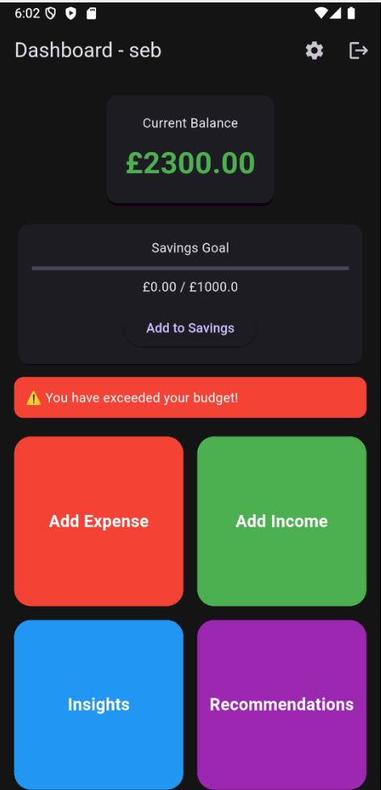
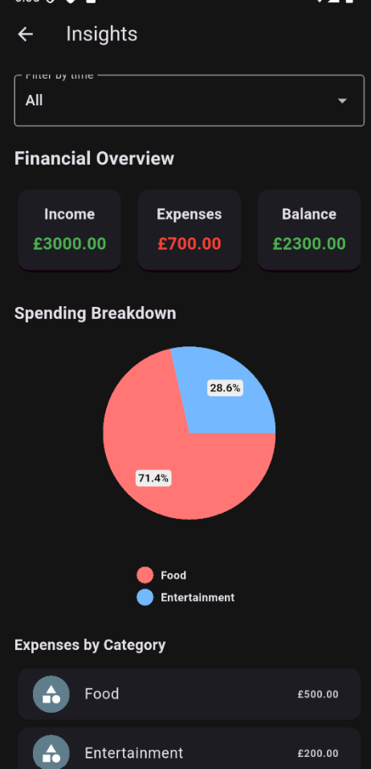
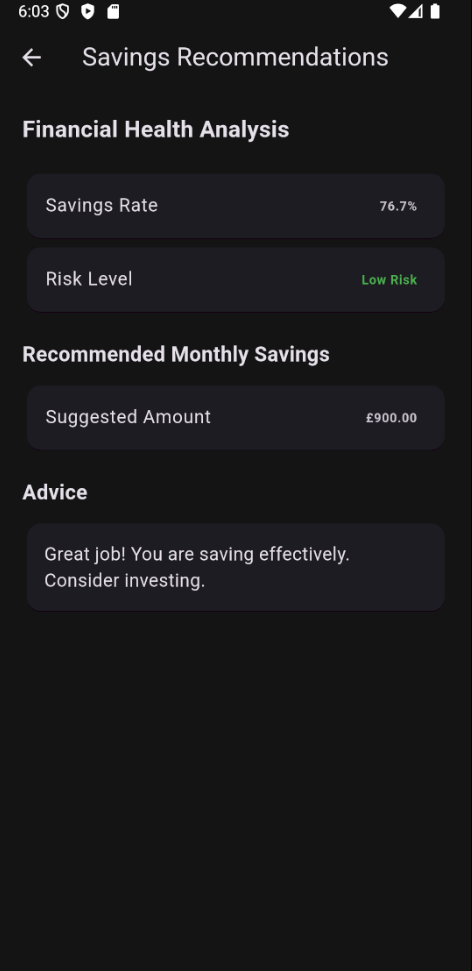
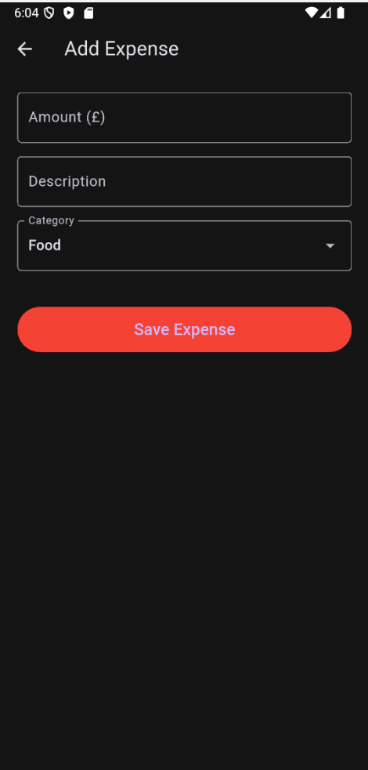

# Student Finance Tracker

A cross-platform mobile application developed using Flutter and Dart to help university students manage their personal finances.

## Overview

The Student Finance Tracker was developed as my final-year Software Engineering project at Sheffield Hallam University.

The application provides users with a centralised way to record and manage their income and expenses, organise transactions into categories, monitor budgets and understand their spending through financial insights and data visualisation.

## Key Features

* Income and expense tracking
* Transaction categorisation
* Budget management
* Recurring transactions
* Financial insights
* Spending data visualisation
* Budget alerts and notifications
* Cross-platform application support

## Technologies

* **Flutter**
* **Dart**
* **Git**
* **GitHub**

## Development

The project was developed as part of my BSc (Hons) Software Engineering degree, following a structured software development process from requirements analysis and system design through to implementation, testing and documentation.

The application was designed with maintainability, usability and scalability in mind.

## Project Structure

The main application source code is contained within the `lib` directory.

Automated and project tests are contained within the `test` directory.

Platform-specific project files are included for Android, iOS, Windows, macOS, Linux and Web.

## Screenshots
### Dashboard


### Financial Insights


### Savings Recommendations


### Expense Management



## Getting Started

### Prerequisites

* Flutter SDK
* Dart SDK
* Android Studio or Visual Studio Code

### Installation

```bash
git clone https://github.com/SebastianAlliaj/student-finance-tracker.git
cd student-finance-tracker
flutter pub get
flutter run
```

## Academic Project

This project was developed as part of the BSc (Hons) Software Engineering degree at Sheffield Hallam University.

**Developer:** Sebastian Alliaj

**Degree:** BSc (Hons) Software Engineering — First Class

